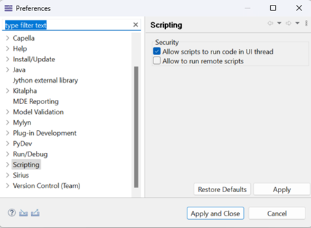

# User guide

## DSM4Capella Project

DSM4Capella allows to get a best logical architecture with minimun coupling value run on genetic algorithm with its initials parameters. The global operation and principles are from previous work by Khetan Y., Gauthier J.M., Dubé S. [Part 5 – Coupling optimization of logical architecture using genetic algorithm – Samares Engineering (samares-engineering.com)](https://www.samares-engineering.com/en/2020/07/31/part-5-coupling-optimization-of-logical-architecture-using-genetic-algorithm/)

## Demo

The following video are the demostration of the algorithm execution

- Analysis of Architecture [Analysis default (youtube.com)](https://www.youtube.com/watch?v=1nrKgCsh4Jw&ab_channel=SAMARES-ENGINEERING)

- Analysis of Architecture with genetic algorithm parameters modified [Expert mode dsm4capella (youtube.com)](https://www.youtube.com/watch?v=jbnIilzkRCc&ab_channel=SAMARES-ENGINEERING)

- Architecture modified as result of analysis [Optimization dsm4capella (youtube.com)](https://www.youtube.com/watch?v=bCLryhEO2jE&ab_channel=SAMARES-ENGINEERING)

## Parameters of genetic algortihm

The DSM4Capella is a PyDev Project is composed by two Folder:

### 1. design_structure_matrix

The design_structure_matrix folder have all scripts related to the design structure matrix with genetic algorithm implementation 

### 2. extensions

The extensions contains the script of Python4Capella 1.2.0 [Release Release 1.2.0 · labs4capella/python4capella · GitHub](https://github.com/labs4capella/python4capella/releases/tag/1.2.0) extended , as the capability to:

- Retreive the childs logical component, logical functions

- Create allocations of Logical Function child in Logical Component child

- Create ComponentExchange connected by ComponentPorts

- Create allocation of FunctionalExchange in ComponentExchange

***This extension should be later integrated into the Python4Capella Project.***

## Processes

The process of script execution is summerized in the image below

The Python4Capella extension is used in the script begins by retrieving the necessary Capella elements from the Logical Architecture level, including Logical Components, Logical Actors, and Logical Functions along with their respective Functional Exchanges. Then a design structure matrix is created, which reperesents the its inter-dependencies (Functional Exchange) between the Logical Functions.

The following example serves as an illustration, showcasing 16 logical functions and their inter-dependencies :

Each Logical Function is assigned a unique index, which is utilized during the algorithm execution. Then is verified the Functions availables for allocation and the Logical Function already allocated.

## Installation

- The environment work is **Capella 1.4.2, Capella 5.2.0 and Capella 6.1.0** [Capella MBSE Tool - Download (mbse-capella.org)](https://mbse-capella.org/download.html)

- You will need to setup **Python** recent versions whith library pandas[Installation — pandas 2.1.4 documentation (pydata.org)](https://pandas.pydata.org/docs/getting_started/install.html) ,numpy [NumPy - Installing NumPy](https://numpy.org/install/) (versions of libraries according to your python version) and openpyxl [openpyxl · PyPI](https://pypi.org/project/openpyxl/) , the project have been executed in the following versions: **Python 3.11.5 ,Numpy 1.24.3, Pandas 2.1.4, openpyxl 3.0.10**. 

- Install **Python4Capella** in your Capella environment  [GitHub - labs4capella/python4capella: Python for Capella](https://github.com/labs4capella/python4capella#installation) . 

- Donwload DSM4Capella 

- Import DSM4Capella in your workspac
  File > Import > General > Projects from Folder or Archive > Directory > choose the DSM4Capella folder downloaded above > Select Folder > make sure that is checked the DSM4Capella folder > Finish

Optional: download an import the model AIDA_basic to run over this model.

In your workspace you should have : the DSM4Capella project, the Python4Capella Project and a Capella model .aird

## Configuration

-  Make sure that you have been specified the python interpreter  and Python Scripting (using Py4J) [GitHub - labs4capella/python4capella: Python for Capella](https://github.com/labs4capella/python4capella)

- Specify the script localisation Window->Preferences->Scripting->Script Locations->Add Workspace->DSM4Capella->design_structure_matrix->Apply and Close
  

- go to Window->Preferences->Scripting->Security->Allow scripts to run code in UI thread -> Apply and Close
  

## How to run the script

1. Right-click on your Logical Architecture and check that you have in the menu the following options
   

2. Select one of option:
   
   1. `Architecture Analysis with DSM: `to explore architecture options and provide solution proposed
   
   2. `Architecture Analysis and Optimization with DSM:` to explore architecture options and implement the solutions proposed

## Parameters of genetic algorithm

Then to start the genetic algorithm is necessary to provide the following configurable parameters:

- **Initial population size**

- **Maximun generation number**

- **Percentage of survivor**

- **Percentage of parents**

- **Percentage of child to mutate**

- **Percentage of gene to mutate**

Configurables parameters means that for each parameters given done differents results. 

For more details of algorithm  parameters go to  [Part 5 – Coupling optimization of logical architecture using genetic algorithm – Samares Engineering (samares-engineering.com)](https://www.samares-engineering.com/en/2020/07/31/part-5-coupling-optimization-of-logical-architecture-using-genetic-algorithm/)

The script contains default parameters for each parameteres that can be modified following these steps:

1. Select the System Engineering of your capella model or select any architecture 

2. Click on the menu DSM4Capella expert mode

and you should have the following menu

In this menu you modify the values as you want and then choce 

`*DSM Analysis:* `to make analysis of architecture and export solution proposed

`*DSM Analysis + Optimization:*` to make analysis of architecture and implement the solution modifying the capella model

3. select Ok

The modification of parameters is recommended for individuals who have knowledge of how this algorithm works, as changing the parameters can impact the results. Furthermore, it is important to adjust these parameters based on the size of the input data.

Once returned the minimun coupling value is replaceds the indexes of capella elements (Logical Function, Logical Component) by its equivalente capella element name.

Allocate the Logical Functions to the Logical Component respecting the Logical Function already allocated wheter is the case. 

 **The allocation is only made from the Logical Function child  to the Logical Component child**, and the Logical Actor is considered always parent not available for allocations.

### Detailled result on console:

**Solution chromosomes:**

On the console you will have a best solution (list )that can be one or more best list with its respective coupling value. If there is more than one best solution is choosen one randomly:

the first value 2 is located in the index 0, this means that the Logical Function index 0 will allocated to the Logical Component index 2 and respectively. 

The index values is replaced by its capella element equivalent, also the Logical Functions constraints (already allocated) is repected. Based on this best solution and the inter-dependencies matrix is calculated the logical components inter-dependencies or intra module dependences.

Then to represent the inter-component dependencies are created the Component Exchanges connected by Component Ports using Python4Capella extension.

One Component Exchange per direction and between Logical Components are created, as this relationship is defined by the Logical Functions relationship is allocated the Functional Exchange respective for each Component Exchange.

## Results exported

After the script execution in your project, you should have 2 excel file created under the file Results

1. `DSM_logical_architecture.xlsx` contains the Design Structure Matrix created based on the Logical Function and Functional Interface
2. `LogicalArchitectureProposed.xlsx` contains the logical architecture proposed 

To open the excel file: Right-click on the .xlsx file ->Open With->System Editor

## Tips

## Show line number

Windows > Preferences > General > Editors > Text Editors > Show line numbers > Apply and Close

## Increase console  output

 Windows > Preferences > Run/Debug > Console > uncheck Limit console output

## Depreciation warning:

If you have the warning:

> org.eclipse.ease.lang.python.py4j_0.8.0.I202104091518\pysrc\ease_py4j_main.py:414: DeprecationWarning: setDaemon() is deprecated, set the daemon attribute instead thread.setDaemon(True)

follow the instruction described below

[Launch script freeze when pandas/numpy is installed · Issue #112 · labs4capella/python4capella · GitHub](https://github.com/labs4capella/python4capella/issues/112)
