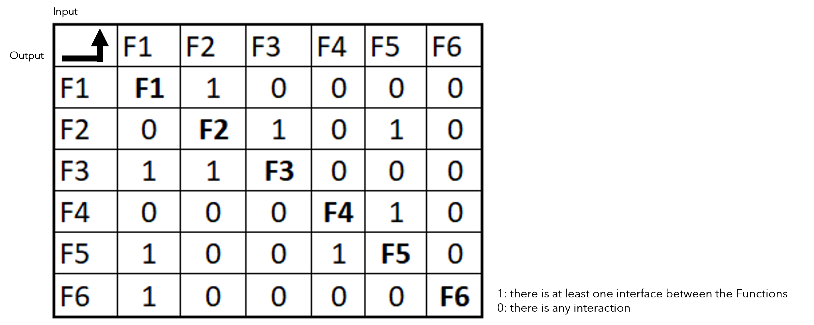
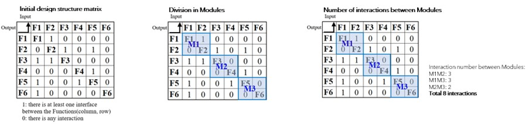
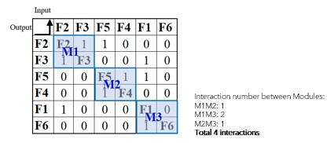
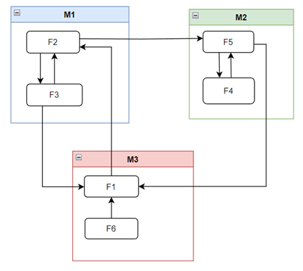
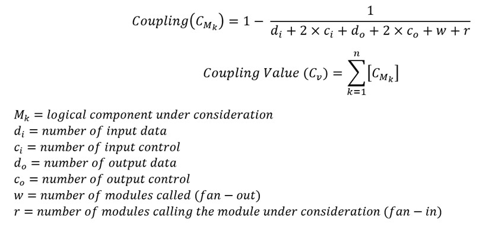
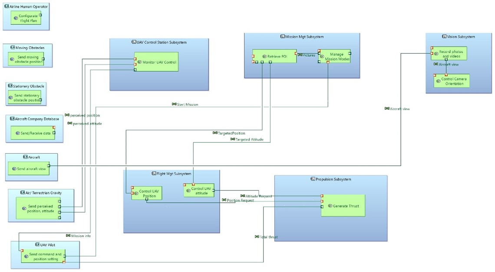
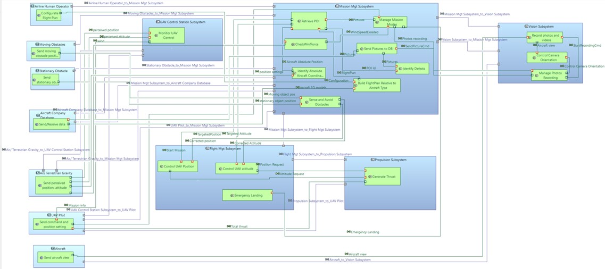

# DSM4Capella

DSM4Capella allows to get a best logical architecture applying Design Structure Matrix giving a minimun coupling value based on initial parameters of genetic algorithm. This approach is an extend of previous work of Khetan Y., Gauthier J. M. and Dubé S.[1].

> The design structure matrix  is a square matrix (i.e., it has an equal number of rows and columns) that shows relationships between elements in a system [2].

This work has been presented in the ERTS 2024 Congress  [ERTS 2024 - 12th European Congress Embedded Real Time Software and Systems](https://erts2024.org/) and available in [Coupling Optimization using Design Structure Matrices and Genetic Algorithm - Archive ouverte HAL](https://hal.science/hal-04632975).

It is used to systematically identify, dene, tabulate, design, and analyze functional and physical interfaces [3].

source: Samares Engineering

Note: 1 there is at least 1 interface between functions and 0 not interaction

## Coupling

Is the degree of interdependence between subsystems, where the low coupling is often a sign of a well-structured system and a good design.

> They can be used during System Architecture Definition with the goal of **keeping the interfaces as simple as possible** [3].

### Coupling process

- Start modularization

- Permutate and recalculate the number of interactions

As a result the functions allocated to components (modules) are:

source: Samares Engineering

## Formula to calculate coupling value

To calculate the coupling have been taken the work of Khetan Y., Gauthier J.M.? Dubé S.[1].

source:[1]
In the matrix, 1 means there is at least 1 interface between functions and 0 means not interaction

At this time, the method considers the input and output control values to be zero because only input and output data are considered in the Capella model.

As algorithm to execute is applied the genetic algorithm.

### Genetic Algorithm summary process

source: [1]

## Demo in capella model supported by Python4Capella

For demo has been created a simplified model of the AIDA (Aircraft Inspection by DroneAssistant) system, that is a Remotely Piloted Aircraft System (RPAS) project. It is composed of a quadcopter drone, a control computer and a remote control. The mission ofthis system is to help the pilot to inspect the aircraft before flight [4].

Starts condition:

- there are some flexibility to allocate the Logical Functions 

- some Logical Functions pre-allocated

source: Samares Engineering

- Use the Python4Capella extension to automate the allocation process and create the logical component relationship within the Capella model

source: Samares Engineering

The method proposed can be useful :

* For system engineer to optimize the logical architecture

* For a company with a logical architecture constrained by its organization and/or experience / existing systems
  
  * Interesting if and only if there's flexibility left to allocate functions on the systems

## References

[1] Khetan Y., Gauthier J.M., Dubé S. Part 5 – Coupling optimization of logical architecture using genetic algorithm. 2020. [Part 5 – Coupling optimization of logical architecture using genetic algorithm – Samares Engineering (samares-engineering.com)](https://www.samares-engineering.com/en/2020/07/31/part-5-coupling-optimization-of-logical-architecture-using-genetic-algorithm/)

[2]Design Structure Matrix Conference [Introduction to DSM – The Design Structure Matrix (DSM) (dsmweb.org)](https://dsmweb.org/introduction-to-dsm/)

[3] System Engineering Handbook. A Guide for System Life Cycle Processes and Activities.Part 3 Life Cycle Analyses and Methods. 5th edition. 2023. Pg 205.

[4] Capella model Version V4.5 [AIDA /](https://sahara.irt-saintexupery.com/AIDA/AIDAArchitecture) [AIDAArchitecture](https://sahara.irt-saintexupery.com/AIDA/AIDAArchitecture) [· GitLab(irt-saintexupery.com)](https://sahara.irt-saintexupery.com/AIDA/AIDAArchitecture)

**Contacts:**

mirna.ojeda@Samares-Engineering.com

sebastien.dube@Samares-Engineering.com
